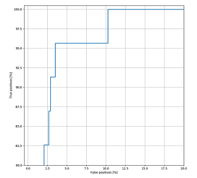

# Chronic Homelessness AI (CHAI) Model 
 

The purpose of this project is deliver a machine learning solution to
assist in identifying individuals at risk of chronic homelessness. A
model was built for the Homeless Prevention division of the City of
London, Ontario, Canada. This work was led by the Municipal Artificial Intelligence Applications Lab out of the Information
Technology Services division. For more information on results of the London project, review our [pre-print article](https://github.com/aildnont/HIFIS-model/blob/master/HIFIS_RNN_MLP%20-%20arXiv%20submission.pdf).This repository contains the code used to
train a neural network model to classify clients in the city's
[Homeless Individuals and Families Information
System](https://www.canada.ca/en/employment-social-development/programs/homelessness/hifis.html)
(HIFIS) database as either at risk or not at risk of chronic
homelessness within a specified predictive horizon. In an effort to
build AI ethically and anticipate forthcoming federal and provincial
regulation of automated decision-making systems, this repository applies
interpretability and bias-reducing methods to explain the model's
predictions. The model also employs functionality to enable ease of
client record removal, entire feature removal and audit trails to
facilitate appeals and other data governance processes. This repository
is intended to serve as a turnkey template for other municipalities
using the HIFIS application and HIFIS database schema who wish to
explore the application of this model in their own locales. This model
was built using data from HIFIS 4.0.57.30.


## Table of Contents
1. [**_Getting Started_**](#getting-started)
2. [**_Use Cases_**](#use-cases)  
   i)
   [_Train a model and visualize results_](#train-a-model-and-visualize-results)  
   ii)
   [_Train multiple models and save the best one_](#train-multiple-models-and-save-the-best-one)  
   iii)
   [_Prediction horizon search experiment_](#prediction-horizon-search-experiment)  
   iv) [_LIME explanations_](#lime-explanations)  
   v) [_Random hyperparameter search_](#random-hyperparameter-search)  
   vi)
   [_Batch predictions from raw data_](#batch-predictions-from-raw-data)  
   vii) [_Cross validation_](#cross-validation)  
   viii)
   [_Exclusion of sensitive features_](#exclusion-of-sensitive-features)  
   ix)
   [_Client clustering experiment (using K-Prototypes)_](#client-clustering-experiment-using-k-prototypes)
3. [**_Time Series Forecasting Model_**](#time-series-forecasting-model)  
   i) [_Time series data_](#time-series-data)  
   ii) [_RNN-MLP Hybrid Model_](#rnn-mlp-hybrid-model)  
   iii)
   [_Time series LIME explanations_](#time-series-lime-explanations)  
   iv) [_Steps to use_](#steps-to-use)
4. [**_Troubleshooting_**](#troubleshooting)
5. [**_Project Structure_**](#project-structure)
6. [**_Project Config_**](#project-config)
7. [**_Azure Machine Learning Pipelines_**](#azure-machine-learning-pipelines)  
   i) [_Additional steps for Azure_](#additional-steps-for-azure)
8. [**_Contact_**](#contact)

## Getting Started
1. Clone this repository (for help see this
   [tutorial](https://help.github.com/en/github/creating-cloning-and-archiving-repositories/cloning-a-repository)).
2. Install the necessary dependencies (listed in
   [requirements.txt](requirements.txt)). To do this, open a terminal in
   the root directory of the project and run the following:
   ```
   $ pip install -r requirements.txt
   ```
3. Open [_retrieve_raw_data.ps1_](retrieve_raw_data.ps1) for
   editing. Replace "_[Instance Name goes here]_" with your HIFIS
   database instance name. Execute
   [_retrieve_raw_data.ps1_](retrieve_raw_data.ps1). A file
   named _"HIFIS_Clients.csv"_ should now be within the _data/raw/_
   folder. See
   [HIFIS_Clients_example.csv](data/raw/HIFIS_Clients_example.csv) for
   an example of the column names in our _"HIFIS_Clients.csv"_ (note
   that the data is fabricated; this file is included for illustrative
   purposes).
4. Check that your features in _HIFIS_Clients.csv_ match in
   [config.yml](config.yml). If necessary, update feature
   classifications in this file (for help see
   [Project Config](#project-config)).
5. Execute [_preprocess.py_](src/data/preprocess.py) to transform the
   data into the format required by the machine learning model.
   Preprocessed data will be saved within _data/preprocessed/_.
6. Execute [_train.py_](src/train.py) to train the neural network model
   on your preprocessed data. The trained model weights will be saved
   within _results/models/_, and its filename will resemble the
   following structure: modelyyyymmdd-hhmmss.h5, where yyyymmdd-hhmmss
   is the current time. The
   [TensorBoard](https://www.tensorflow.org/tensorboard) log files will
   be saved within _results/logs/training/_.
7. In [config.yml](config.yml), set _MODEL_TO_LOAD_ within _PATHS_ to
   the path of the model weights file that was generated in step 6 (for help see
   [Project Config](#project-config)).
   Execute [_lime_explain.py_](src/interpretability/lime_explain.py) to
   generate interpretable explanations for the model's predictions on
   the test set. A spreadsheet of predictions and explanations will be
   saved within _results/experiments/_.


## Use Cases

### Train a model and visualize results
1. Once you have _HIFIS_Clients.csv_ sitting in the raw data folder
   (_data/raw/), execute [_preprocess.py_](src/data/preprocess.py). See
   [Getting Started](#getting-started) for help obtaining
   _HIFIS_Clients.csv_.
2. Ensure data has been preprocessed properly. That is, verify that
   _data/processed/_ contains both _HIFIS_Processed.csv_ and
   _HIFIS_Processed_OHE.csv_. The latter is identical to the former with
   the exception being that its single-valued categorical features have
   been one-hot encoded.
3. In [config.yml](config.yml), set _EXPERIMENT_ within _TRAIN_ to
   _'single_train'_.
4. Execute [train.py](src/train.py). The trained model's weights will be
   located in _results/models/_, and its filename will resemble the
   following structure: modelyyyymmdd-hhmmss.h5, where yyyymmdd-hhmmss
   is the current time. The model's logs will be located in
   _results/logs/training/_, and its directory name will be the current
   time in the same format. These logs contain information about the
   experiment, such as metrics throughout the training process on the
   training and validation sets, and performance on the test set. The
   logs can be visualized by running
   [TensorBoard](https://www.tensorflow.org/tensorboard) locally. See
   below for an example of a plot from a TensorBoard log file depicting
   loss on the training and validation sets vs. epoch. Plots depicting
   the change in performance metrics throughout the training process
   (such as the example below) are available in the _SCALARS_ tab of
   TensorBoard.  
     
   You can also visualize the trained model's performance on the test
   set. See below for an example of the ROC Curve and Confusion Matrix
   based on test set predictions. In our implementation, these plots are
   available in the _IMAGES_ tab of TensorBoard.  
   
   

The diagram below depicts an overview the model's architecture. We call
this model _"HIFIS MLP"_, as the model is an example of a multilayer
perceptron. _NODES0_ and _NODES1_ correspond to hyperparameters
configurable in [config.yml](config.yml).


### Train multiple models and save the best one
Not every model trained will perform at the same level on the test set.
This procedure enables you to train multiple models and save the one
that scored the best result on the test set for a particular metric that
you care about optimizing.
1. Follow steps 1 and 2 in
   [Train a model and visualize results](#train-a-model-and-visualize-results).
2. In [config.yml](config.yml), set _EXPERIMENT_ within _TRAIN_ to
   _'multi_train'_.
3. Decide which metrics you would like to optimize and in what order. In
   [config.yml](config.yml), set _METRIC_PREFERENCE_ within _TRAIN_ to
   your chosen metrics, in order from most to least important. For
   example, if you decide to select the model with the best recall on
   the test set, set the first element in this field to _'recall'_.
4. Decide how many models you wish to train. In
   [config.yml](config.yml), set _NUM_RUNS_ within _TRAIN_ to your
   chosen number of training sessions. For example, if you wish to train
   10 models, set this field to _10_.
5. Execute [train.py](src/train.py). The weights of the model that had
   the best performance on the test set for the metric you specified
   will be located in _results/models/training/_, and its filename will
   resemble the following structure: modelyyyymmdd-hhmmss.h5, where
   yyyymmdd-hhmmss is the current time. The model's logs will be located
   in _results/logs/training/_, and its directory name will be the
   current time in the same format.

### LIME explanations
Since the predictions made by this model are to be used by a government
institution to benefit vulnerable members of society, it is imperative
that the model's predictions may be explained so as to facilitate
ensuring the model is making responsible predictions, as well as
assuring transparency and accountability of government decision-making
processes. Since this model is a neural network, it is difficult to
decipher which rules or heuristics it is employing to make its
predictions. Interpretability in machine learning is a growing concern,
especially with applications in the healthcare and social services
domains. We used [Local Interpretable
Model-Agnostic Explanations](https://arxiv.org/pdf/1602.04938.pdf) (i.e.
LIME) to explain the predictions of the neural network classifier that
we trained. We used the implementation available in the authors' [GitHub
repository](https://github.com/marcotcr/lime). LIME perturbs the
features in an example and fits a linear model to approximate the neural
network at the local region in the feature space surrounding the
example. It then uses the linear model to determine which features were
most contributory to the model's prediction for that example. By
applying LIME to our trained model, we can conduct informed feature
engineering based on any obviously inconsequential features we see (e.g.
_EyeColour_) or insights from domain experts. We can also tell if the
model is learning any unintended bias and eliminate that bias through
additional feature engineering. See the steps below to apply LIME to
explain the model's predictions on examples in the test set.
1. Having previously run _[train.py](src/train.py)_, ensure that
   _data/processed/_ contains both _Train_Set.csv_ and _Test_Set.csv_.
2. In [config.yml](config.yml), set _MODEL_TO_LOAD_ within _PATHS_ to
   the path of the model weights file (_.h5_ file) that you wish to use
   for prediction.
3. By setting the appropriate value in the _EXPERIMENT_ field of _LIME_
   in [config.yml](config.yml), you can select to either **(i)** perform
   a LIME experiment on the test set, **(ii)** perform a submodular
   pick, or **(iii)** run LIME on 1 test set example. Once the
   appropriate field is set, execute
   [lime_explain.py](src/interpretability/lime_explain.py).
   1. By setting the _EXPERIMENT_ field of _LIME_ in
      [config.yml](config.yml) to _'lime_experiment'_, you will run LIME
      on all examples in the test set, create a .csv file of the
      results, and produce a visualization of the average explainable
      feature rules. The .csv file will be located in
      _results/experiments/_, and will be called
      _lime_experimentyyyymmdd-hhmmss.csv_, where yyyymmdd-hhmmss is the
      current time. The visualization will be located in
      _documents/generated_images/_, and will be called
      _LIME_Eplanations_yyyymmdd-hhmmss.csv_.
   2. By setting the _EXPERIMENT_ field of _LIME_ in
      [config.yml](config.yml) to _'submodular_pick'_, you will run the
      submodular pick algorithm (as described in the
      [LIME paper](https://arxiv.org/abs/1602.04938)) to pick and
      amalgamate a set explanations of training set examples that
      attempt to explain the model's functionality as a whole. Global
      surrogate explanations and weights will be saved to a .csv file
      and depicted in a visualization. The .csv file will be located in
      _results/experiments/_, and will be called
      _lime_submodular_pick.csv_. Subsequent submodular picks will be
      appended to this file with timestamps. The visualization will be
      located in _documents/generated_images/_, and will be called
      _LIME_Submodular_Pick_yyyymmdd-hhmmss.csv_.
   3. By setting the _EXPERIMENT_ field of _LIME_ in
      [config.yml](config.yml) to _'explain_client'_, you will run LIME
      on the example in the test set whose ClientID is that which you
      passed to the function. You will have to set the Client ID of a
      client who is in the test set in the main function of
      [lime_explain.py](src/interpretability/lime_explain.py) (it
      currently reads ```client_id = lime_dict['Y_TEST'].index[0][0]```,
      which selects the first ClientID in the test set). An image will
      be generated that depicts the top explainable features that the
      model used to make its prediction. The image will be automatically
      saved in _documents/generated_images/_, and its filename will
      resemble the following:
      _Client_client_id_exp_yyyymmdd-hhmmss.png_. See below for an
      example of this graphic.
4. Interpret the output of the LIME explainer. LIME partitions features
   into classes or ranges and reports the features most contributory to
   a prediction. A feature explanation is considered to be a value (or
   range of values) of a feature and its associated weight in the
   prediction. In the example portrayed by the bar graph below, the fact
   that _TotalStays_ was greater than 4 but less than or equal to 23
   contributed negatively with a magnitude of about 0.22 to a positive
   prediction (meaning it contributed at a magnitude of 0.22 toward a
   negative prediction). As another example, the rule
   _"ReasonForService_Streets=1"_ indicates that at some point the client
   has a record that cites their reason for service as _"Streets"_ (_=1_
   indicates that a Boolean feature is present, and _=0_ indicates that
   a Boolean feature is not present) and that this explanation
   contributed with a weight of about 0.02 toward a positive prediction.
   As one last example, consider that this client's _AboriginalIndicator_
   value is _"Yes - Tribe Not Known"_, which contributed with a weight of
   about 0.04 towards a negative prediction.

**NOTE**: Many clients have incomplete records. To represent missing values, default values are inserted into the dataset. You may see these values when examining LIME explanations.
- Missing records for numerical features are given a value of _-1_
- Missing records for categorical features are given a value of _"Unknown"_


### Random hyperparameter search
Hyperparameter tuning is an important part of the standard machine
learning workflow. We chose to conduct a series of random hyperparameter
searches. The results of one search informed the next, leading us to
eventually settle on the hyperparameters currently set in the _TRAIN_
and _NN_ sections of [config.yml](config.yml). We applied TensorBoard
visualization to aid the random hyperparameter search. With the help of
the [HParam
Dashboard](https://www.tensorflow.org/tensorboard/hyperparameter_tuning_with_hparams),
one can see the effect of different combinations of hyperparameters on
the model's test set performance metrics.

In our random hyperparameter search, we study the effects of _x_ random
combinations of hyperparameters by training the model _y_ times for each
of the _x_ combinations and recording the results. See the steps below
on how to conduct a random hyperparameter search. Note that if you are
not planning on changing the hyperparameters or their ranges, you may
skip steps 2-4, as a default set of hyperparameter ranges is already
defined in code.
1. In the in the _HP_ subsection of the _TRAIN_ section of
   [config.yml](config.yml), set the number of random combinations of
   hyperparameters you wish to study and the number of times you would
   like to train the model for each combination (see
   [Project Config](#train) for help).
   ```
   COMBINATIONS: 60
   REPEATS: 2
   ```
2. Set the ranges of hyperparameters you wish to study in the _HP_
   subsection of the _TRAIN_ section of [config.yml](config.yml). The
   config file already has a comprehensive set of hyperparameter ranges
   defined (as shown below), so you may not need to change anything in
   this step. Consider whether your hyperparameter ranges are continuous
   (i.e. real) or discrete and whether any need to be investigated on
   the logarithmic scale.
   ```
      NODES0: [80, 100]               # Discrete range
      NODES1: [60, 80]                # Discrete range
      LAYERS: [2, 3, 4]               # Discrete range
      DROPOUT: [0.2, 0.4]             # Real range
      LR: [-3.0, -3.0]                # Real range on logarithmic scale (10^x)
      OPTIMIZER: ['adam', 'sgd']      # Discrete range
      BETA_1: [-1.0, -1.0]            # 1st moment for Adam. Real range on log scale (1 - 10^x)
      BETA_2: [-3.0, -3.0]            # 2nd moment for Adam. Real range on log scale (1 - 10^x)
      L2_LAMBDA: [-2.0, -2.0]         # Real range on log scale (10^x)
      BATCH_SIZE: [128, 256]          # Discrete range
      POS_WEIGHT: [0.6, 0.7]          # Weight multiplier for positive class. Real range
      IMB_STRATEGY: ['class_weight', 'smote', 'random_oversample']  # Discrete range
   ```
3.  Within the _random_hparam_search()_ function defined in
    [train.py](src/train.py), ensure your hyperparameters are added as
    HParam objects to the list of hyperparameters being considered. The
    below code is already included in [train.py](src/train.py); only
    change it if you have changed the default hyperparameter ranges in
    [config.yml](config.yml).
    ```
    HPARAMS.append(hp.HParam('NODES0', hp.Discrete(hp_ranges['NODES0'])))
    HPARAMS.append(hp.HParam('NODES1', hp.Discrete(hp_ranges['NODES1'])))
    HPARAMS.append(hp.HParam('LAYERS', hp.Discrete(hp_ranges['LAYERS'])))
    HPARAMS.append(hp.HParam('DROPOUT', hp.RealInterval(hp_ranges['DROPOUT'][0], hp_ranges['DROPOUT'][1])))
    HPARAMS.append(hp.HParam('L2_LAMBDA', hp.RealInterval(hp_ranges['L2_LAMBDA'][0], hp_ranges['L2_LAMBDA'][1])))
    HPARAMS.append(hp.HParam('LR', hp.RealInterval(hp_ranges['LR'][0], hp_ranges['LR'][1])))
    HPARAMS.append(hp.HParam('BETA_1', hp.RealInterval(hp_ranges['BETA_1'][0], hp_ranges['BETA_1'][1])))
    HPARAMS.append(hp.HParam('BETA_2', hp.RealInterval(hp_ranges['BETA_2'][0], hp_ranges['BETA_2'][1])))
    HPARAMS.append(hp.HParam('OPTIMIZER', hp.Discrete(hp_ranges['OPTIMIZER'])))
    HPARAMS.append(hp.HParam('BATCH_SIZE', hp.Discrete(hp_ranges['BATCH_SIZE'])))
    HPARAMS.append(hp.HParam('POS_WEIGHT', hp.RealInterval(hp_ranges['POS_WEIGHT'][0], hp_ranges['POS_WEIGHT'][1])))
    HPARAMS.append(hp.HParam('IMB_STRATEGY', hp.Discrete(hp_ranges['IMB_STRATEGY'])))
    ```
4. If you have added other hyperparameters not listed already in
   [config.yml](config.yml), ensure that you set the hyperparameters
   based on the random combination in either
   [model.py](src/models/models.py) or [train.py](src/train.py).
5.  In [config.yml](config.yml), set _EXPERIMENT_ within the
    _TRAIN_ section to _'hparam_search'_.
6. Execute [train.py](src/train.py). The experiment's logs will be
   located in _results/logs/hparam_search/_, and the directory name will
   be the current time in the following format: _yyyymmdd-hhmmss_. These
   logs contain information on test set metrics with models trained on
   different combinations of hyperparameters. The logs can be visualized
   by running [TensorBoard](https://www.tensorflow.org/tensorboard)
   locally. See below for an example of a view offered by the HParams
   dashboard of TensorBoard. Each point represents 1 training run. The
   graph compares values of hyperparameters to test set metrics.


### Batch predictions from raw data
Once a trained model is produced, the user may wish to obtain
predictions and explanations for all clients currently in the HIFIS
database. As clients' life situations change over time, their records in
the HIFIS database change as well. Thus, it is useful to rerun
predictions for clients every so often. If you wish to track changes in
predictions and explanations for particular clients over time, you can
choose to append timestamped predictions to a file containing previous
timestamped predictions. The steps below detail how to run prediction
for all clients, given raw data from HIFIS and a trained model.
1. Ensure that you have already run
   _[lime_explain.py](src/interpretability/lime_explain.py)_ after
   training your model, as it will have generated and saved a
   LIME Explainer object at _data/interpretability/lime_explainer.pkl_.
2. Ensure that you have _HIFIS_Clients.csv_ located within in the raw
   data folder (_data/raw/_). See [Getting Started](#getting-started)
   for help obtaining _HIFIS_Clients.csv_.
3. In [config.yml](config.yml), set _MODEL_TO_LOAD_ within _PATHS_ to
   the path of the model weights file (_.h5_ file) that you wish to use
   for prediction.
4. By changing the value of the _EXPERIMENT_ field of the _PREDICTION_
   section of [config.yml](config.yml) to your desired experiment, you
   can opt to either **(i)** save predictions to a new file or **(ii)**
   append predictions and their corresponding timestamps to a file
   containing past predictions.
   1. Setting the _EXPERIMENT_ field of the _PREDICTION_ section of
      [config.yml](config.yml) to _'batch_prediction'_ will preprocess
      raw client data, run prediction for all clients, and run LIME to
      explain these predictions. Results will be saved in a .csv file,
      which will be located in _results/predictions/_, and will be
      called _predictionsyyyymmdd-hhmmss.csv_, where yyyymmdd-hhmmss is
      the current time.
   2. Setting the _EXPERIMENT_ field of the _PREDICTION_ section of
      [config.yml](config.yml) to _'trending_prediction'_ will produce
      predictions and explanations in the same method as described in
      (i), but will include timestamps for when the predictions were
      made. The results will be appended to a file called
      _trending_predictions.csv_, located within _results/prediction/_.
      This file contains predictions made at previous times, enabling
      the user to compare the change in predictions and explanations for
      particular clients over time.
5.  Execute [predict.py](src/predict.py).

### Cross validation
Cross validation helps us select a model that is as unbiased as possible
towards any particular dataset. By using cross validation, we can be
increasingly confident in the external validity of our results. This
repository offers a means to run cross validation for both models
defined. We include cross validation as a training experiment.

Note that the cross validation experiment differs for the HIFIS-MLP
model and the HIFIS-RNN-MLP. K-fold cross validation is used in the case
of HIFIS-MLP, whereas nested cross-validation with day-forward chaining
is used for HIFIS-RNN-MLP. The difference in our cross validation
algorithms is a result of the different types of data used for both
scenarios. In HIFIS-MLP, data is randomly partitioned by ClientID into
training/validation/test sets. Since HIFIS-RNN-MLP learns from time
series data, the validation and test sets are taken to be the
second-most and most recent partitions of data respectively (and are
therefore not random). Nested cross validation is a commonly used
strategy for time series data.

To run cross validation, see the steps below:
1. Follow steps 1 and 2 in
   [Train a model and visualize results](#train-a-model-and-visualize-results).
2. In [config.yml](config.yml), set _EXPERIMENT_ within _TRAIN_ to
   _'cross_validation'_.
3. Execute [train.py](src/train.py). A model will be trained for each
   train/test fold. A CSV will be generated that reports the performance
   metrics on the test sets for each fold, along with the mean and
   standard deviation of metrics for all folds. The file will be located
   in _results/experiments/_, and its filename will resemble the
   following structure: _kFoldCVyyyymmdd-hhmmss.csv_, if you are
   training the HIFIS-MLP model (which is the default). If you are
   training the HIFIS-RNN-MLP model, the file will be called
   _nestedCVyyyymmdd-hhmmss.csv_.

### Prediction horizon search experiment
The prediction horizon (_N_) is defined as the amount of time from now
that the model makes its predictions for. In our case, the prediction
horizon is how far in the future (in weeks) the model is predicting risk
of chronic homelessness. For example, if the _N_ = 26 weeks, then the
model is predicting whether or not a client will be at risk of chronic
homelessness in 26 weeks. While developing this model, we noticed that
the model's performance is inversely correlated with the prediction
horizon. The Prediction Horizon Search Experiment conducts [cross
validation](#cross-validation) at multiple values of _N_. For each value of _N_, the
data is retrospectively preprocessed by cutting off the most recent _N_
weeks of records. The relationships of _N_ and several model metrics are
graphed for the user to deliver insight on the impact of _N_ and make a
business decision as to which value yields optimal results. See below
for instructions on how to run a Prediction Horizon Search Experiment.
1. In the _HORIZON_SEARCH_ section of [config.yml](config.yml), set
   _N_MIN_, _N_MAX_, _N_INTERVAL_ and _RUNS_PER_N_ according to your
   organization's needs (see [Project Config](#project-config) for help).
2. Run _src/horizon_search.py_. This may take several minutes to hours,
   depending on your hardware and settings from the previous step.
3. A .csv representation of experiment results will be available within
   _results/experiments/_, called _horizon_searchyyyymmdd-hhmmss.csv_,
   where yyyymmdd-hhmmss is the current time. A graphical representation
   of the results will be available within
   _documents/generated_images/_, called
   _horizon_experiment_yyyymmdd-hhmmss.png_. See below for an example of
   this visualization.


### Exclusion of sensitive features
Depending on your organization's circumstances, you may wish to exclude
specific HIFIS features that you consider sensitive due to legal,
ethical or social reasons. A simply way to ensure that a feature does
not cause bias in the model is to avoid including it as a feature of the
model. This project supports the exclusion of specific features by
dropping them at the start of data preprocessing. See the below steps
for details on how to accomplish this:
1. Having completed steps 1-3 in [Getting Started](#getting-started),
   open the raw HIFIS data (i.e. _"HIFIS_Clients.csv"_), which should
   be within the _data/raw/_ folder.
2. Features that the model will be trained on correspond to the column
   names of this file. Decide which features you wish to exclude from
   model training. Take note of these column names.
3. Open [config.yml](config.yml) for editing. Add the column names that
   you decided on during step 2 to the list of features detailed in the
   _FEATURES_TO_DROP_FIRST_ field of the _DATA_ section of
   [config.yml](config.yml) (for more info see [Project Config](#data)).

### Client clustering experiment (using K-Prototypes)
We were interested in investigating whether HIFIS client data could be
clustered. Since HIFIS consists of numerical and categorical data, and
in the spirit of minimizing time complexity,
[k-prototypes](https://www.semanticscholar.org/paper/CLUSTERING-LARGE-DATA-SETS-WITH-MIXED-NUMERIC-AND-Huang/d42bb5ad2d03be6d8fefa63d25d02c0711d19728)
was selected as the clustering algorithm. We wish to acknowledge Nico de
Vos, as we made use of his
[implementation](https://github.com/nicodv/kmodes) of k-prototypes. This
experiment runs k-prototypes a series of times and selects the best
clustering (i.e. least average dissimilarity between clients and their
assigned clusters' centroids). Our intention is that by examining
clusters and obtaining their LIME explanations, one can gain further
insight into patterns in the data and how the model behaves in different
scenarios. By following the steps below, you can cluster clients into a
desired number of clusters, examine the clusters' centroids, and view
LIME explanations of these centroids.
1. Ensure that you have already run
   _[lime_explain.py](src/interpretability/lime_explain.py)_ after
   training your model, as it will have generated and saved a LIME
   Explainer object at _data/interpretability/lime_explainer.pkl_.
2. Ensure that you have a .CSV file of preprocessed data located within
   in the processed data folder (_data/processed/_). See
   [Getting Started](#getting-started) for help.
3. Set the _EXPERIMENT_ field of the _K-PROTOTYPES_ section of
   [config.yml](/config.yml) to _'cluster_clients'_.
4. Run _[cluster.py](src/interpretability/cluster.py)_. Consult
   [Project Config](#k-prototypes) before changing default clustering
   parameters in [config.yml](/config.yml).
5. 3 separate files will be saved once clustering is complete:
   1. A spreadsheet depicting cluster assignments by Client ID will be
      located at _results/experiments/_, and it will be called
      _client_clusters_yyyymmdd-hhmmss.csv_ (where yyyymmdd-hhmmss is
      the current time).
   2. Cluster centroids will be saved to a spreadsheet. Centroids have
      the same features as clients and their LIME explanations will be
      appended to the end by default. The spreadsheet will be located at
      _results/experiments/_, and it will be called
      _cluster_centroids_yyyymmdd-hhmmss.csv_.
   3. A graphic depicting the LIME explanations of all centroids will be
      located at _documents/generated_images/_, and it will be called
      _centroid_explanations_yyyymmdd-hhmmss.png_.

A tradeoff for the efficiency of k-prototypes is the fact that the
number of clusters must be specified a priori. In an attempt to
determine the optimal number of clusters, the
[Average Silhouette Method](https://uc-r.github.io/kmeans_clustering#silo)
was implemented. During this procedure, different clusterings are
computed for a range of values of _k_. A graph is produced that plots
average Silhouette Score versus _k_. The higher average Silhouette Score
is, the more optimal _k_ is. To run this experiment, see the below
steps.
1. Follow steps 1 and 2 as outlined above in the clustering
   instructions.
2. Set the _EXPERIMENT_ field of the _K-PROTOTYPES_ section of
   [config.yml](/config.yml) to _'silhouette_analysis'_. At this time,
   you may wish to change the _K_MIN_ and _K_MAX_ field of the
   _K-PROTOTYPES_ section from their defaults. Values of _k_ in the
   integer range of _[K_MIN, K_MAX]_ will be investigated.
3. Run _[cluster.py](src/interpretability/cluster.py)_. An image
   depicting a graph of average Silhouette Score versus _k_ will be
   saved to _documents/generated_images/_, and it will be called
   _silhouette_plot_yyyymmdd-hhmmss.png_. Upon visualizing this graph,
   note that a larger average Silhouette Score implies a more quality
   clustering.

## Time Series Forecasting Model
Later research involved developing a model that reformulates client
service usage as time series features. The motivation behind the
investigation of time series forecasting was to discover if capturing
service usage changes over time would better reflect the episodic nature
of homelessness, thereby improving model predictions for clients at
different times. The hope was that time series service features would
give further context to a client's story that could be formalized as an
example. This section will describe the changes in the features,
dataset, model, and explanations.

### Time series data
Features that describe client service usage (e.g. stays, case
management, food bank visits) are quantified over time. In the original
HIFIS MLP model, these features were totalled up to the date of the
example. Here, we define a _timestep_ (by default, 30 days) and include
total service usage over a timestep as a feature. The _input sequence
length_ (i.e. _T_X_) defines how many of the most recent timesteps to
include in a single client record. For instance, suppose that the
timestep is 30 days and _T_X_ is 6. A single client record will contain
total service usage features for that client at a particular timestamp,
as well as time series service features corresponding to total service
usage during each of the 6 most recent timesteps.

An additional benefit of formulating time series client records was that
the aggregate dataset can contain records for clients at different
dates. Therefore, the dataset is indexed by ClientID and Date. During
data preprocessing, records are calculated for each client at different
dates. The result is a significantly larger dataset than was used for
the MLP model.

Since the dataset contains different records for each client at various
dates, the training, validation and test sets are partitioned by Date,
instead of randomly by ClientID. The test and validation sets comprise
the most recent and second most recent records for all clients. The
training set is taken to be all records with dates earlier than those in
the test and validation sets. This way, the model is tested on the most
recent client data and is likely to perform well on new client data. Due
to the non-random partitions of training, validation and test sets, the
cross validation experiment used in this repository for time series data
is nested cross validation with day-forward chaining (see [Cross
Validation](#cross-validation) for more info).

### RNN-MLP hybrid model
The time series forecasting model is different than that of the first
model described. The first iteration of the HIFIS model was a
multi-layer preceptron (MLP). The time series forecasting model we
developed has a hybrid recurrent neural network (RNN) and MLP
architecture. This model, dubbed _"RNN-MLP model"_, captures the state
of time series features by incorporating an LSTM layer through which the
time series features are fed. The static features (i.e. non-time-series
features) are concatenated with the output of the LSTM layer, and fed
into an MLP, whose output is the model's decision. Examples of static
features include demographic attributes. Total service features are also
included in this group, as they capture a client's service usage since
the beginning of their inclusion in HIFIS. See below for a diagram
summarizing the RNN-MLP's architecture.


### Time series LIME explanations
Explanations are computed for the RNN-MLP model in the same way as they
were for the original MLP model, except that they are computed for
predictions for a particular client at a particular date. We found that
time series features (especially those of total stays during different
timesteps) appeared more often as being important in explanations. The
time series features are named for their position in the input sequence
and the duration of the timestep. For example, a feature called
_"(-2)30-Day_Stay"_ indicates the total number of stays that a client
had 2 timesteps ago, where the timestep duration is 30 days.
Additionally, stable explanations take longer to compute for the RNN-MLP
models.

### Steps to use
1. In [config.yml](config.yml), set _MODEL_DEF_ within _TRAIN_ to
   _'hifis_rnn_mlp'_.
2. Follow steps 1-4 in
   _[Train a model and visualize results](#train-a-model-and-visualize-results)_
   to preprocess the raw data and train a model.
3. See the steps in _[LIME Explanations](#lime-explanations)_ for
   instructions on how to run different explainability experiments. If
   you wish to explain a single client, be sure that you pass a value
   for the _date_ parameter to _explain_single_client()_ in the
   _yyyy-mm-dd_ format.

## Troubleshooting

Below are some common error scenarios that you may experience if you
apply this repository to your municipality's HIFIS database, along with
possible solutions.
- **_KeyError: "['MyFeature'] not found in axis"_**  
  Commonly occurs if you have specified a feature in one of the lists of
  the _DATA_ seection of [config.yml](config.yml) that does not exist as
  a column in the CSV of raw data extracted from the HIFIS database.
  This could occur if one of the default features in those lists does
  not exist in your HIFIS database. To fix this, remove the feature (in
  this case called 'MyFeature') from the appropriate list in
  [config.yml](config.yml).
- **A feature in your database is missing in the preprocessed data CSV**  
  All features are either classified as noncategorical or categorical.
  You must ensure that the lists defined at _DATA >
  NONCATEGORICAL_FEATURES_ and _DATA > CATEGORICAL_FEATURES_ (in
  [config.yml](config.yml)) include the column names in your raw data
  that you wish to use as features for the model.
- **Incorrect designation of feature as noncategorical vs. categorical**  
  The lists defined in [config.yml](config.yml) at _DATA >
  NONCATEGORICAL_FEATURES_ and _DATA > CATEGORICAL_FEATURES_ must
  correctly classify features as noncategorical or categorical. Strange
  errors may be encountered during execution of
  _vec_multi_value_cat_features()_ during preprocessing if these are set
  incorrectly. Remember that categorical features can take on one of a
  finite amoount of possible values; whereas, noncategorical features
  are numeric variables whose domains exist within the real numbers. For
  example, _'Citizenship'_ is a categorical feature and
  _'CurrentWeightKG'_ is a noncategorical feature.
- **File "preprocess.py", line 443, in assemble_time_sequences
  IndexError: list index out of range**  
  This error can indicate that your raw data does not go as far back in
  time as needed to produce preprocessed data, given the parameters that
  you set. It is important to ensure that the sum of the prediction
  horizon and the length of time covered by each time series example is
  less than the total time over which raw data was collected. For
  example, if the prediction horizon is 26 weeks (found at _DATA >
  N_WEEKS_ in [config.yml](config.yml)], time step length is 30 days
  (found at _DATA > TIME_SERIES > TIME_STEP_), and input sequence length
  is 6 (found at _DATA > TIME_SERIES > _T_X_), then you should have at
  least _26×7 + 30×6 = 362_ days of raw HIFIS data. Note that this is
  the very minimum - you should have significantly more days of HIFIS
  data than this value in order to train an effective model. Finally, If
  preprocessing causes your resultant dataset to be small, you may
  encounter poor results when training a model; therefore, consider that
  the absence of this error does not guarantee that you have enough raw
  data.
- **_OSError: SavedModel file does not exist at:
  results/models/model.h5/{saved_model.pbtxt|saved_model.pb}_**  
  This common error, experienced when attempting to load model weights
  from disk from a non-existent file path, may can occur in either
  [lime_explain.py](src/interpretability/lime_explain.py),
  [predict.py](src/predict.py), or
  [cluster.py](src/interpretability/cluster.py). The model weights' path
  is set at the _PATHS > MODEL_TO_LOAD_ field of
  [config.yml](config.yml). You must change its default value from
  _'model.h5'_ to the filename of a model weights file that exists in
  _results/models/_. Note that trained models are automatically saved
  with a filename following the convention _'modelyyyymmdd-hhmmss.h5'_,
  where _yyyymmdd-hhmmss_ is a datetime.
- **Out-of-memory error during LIME submodular pick**  
  Submodular pick involves generating LIME explanations for a large
  number of examples in the training set. The LIME package used in this
  repository tends to use larger amounts of memory than is required to
  temporarily store the list of explanations accumulated during a
  submodular pick experiment. Generating too high of a number of
  explanations during this experiment can cause out-of-memory errors,
  depending on available RAM. The only known fix is to decrease the
  fraction of training set examples to use during submodular pick. This
  value may be found at the _LIME > SP > SAMPLE_FRACTION_ field of
  [config.yml](config.yml). To illustrate this issue, we had to set this
  value to 0.2 when running submodular pick on a training set of
  approximately 90000 records on a virtual machine with 56 GiB of RAM.

## Project Structure
The project looks similar to the directory structure below. Disregard
any _.gitkeep_ files, as their only purpose is to force Git to track
empty directories. Disregard any _.\__init\__.py_ files, as they are
empty files that enable Python to recognize certain directories as
packages.

```
├── azure                         <- folder containing Azure ML pipelines
├── data
│   ├── interpretability          <- Generated feature information
│   ├── processed                 <- Products of preprocessing
│   ├── raw                       <- Raw data from SQL query
│   └── transformers              <- Serialized sklearn transformers
|
├── documents
|   ├── generated_images          <- Visualizations of model performance, experiments
|   └── readme_images             <- Image assets for README.md
├── results
│   ├── experiments               <- Experiment results
│   ├── logs                      <- TensorBoard logs
│   ├── models                    <- Trained model weights
│   └── predictions               <- Model predictions and explanations
|
├── src
│   ├── custom                    <- Custom TensorFlow components
|   |   └── metrics.py            <- Definition of custom TensorFlow metrics
│   ├── data                      <- Data processing
|   |   ├── queries
|   |   |   ├── client_export.sql <- SQL query to get raw data from HIFIS database
|   |   |   └── SPDAT_export.sql  <- SQL query to get SPDAT data from database
|   |   ├── preprocess.py         <- Main preprocessing script
|   |   └── spdat.py              <- SPDAT data preprocessing script
│   ├── interpretability          <- Model interpretability scripts
|   |   ├── cluster.py            <- Script for learning client clusters
|   |   ├── lime_base.py          <- Modified version of file taken from lime package
|   |   ├── lime_explain.py       <- Script for generating LIME explanations
|   |   ├── lime_tabular.py       <- Modified version of file taken from lime package
|   |   └── submodular_pick.py    <- Modified version of file taken from lime package
│   ├── models                    <- TensorFlow model definitions
|   |   └── models.py             <- Script containing model definition
|   ├── visualization             <- Visualization scripts
|   |   └── visualize.py          <- Script for visualizing model performance metrics
|   ├── horizon_search.py         <- Script for comparing different prediction horizons
|   ├── predict.py                <- Script for prediction on raw data using trained models
|   └── train.py                  <- Script for training model on preprocessed data
|
├── .gitignore                    <- Files to be be ignored by git.
├── config.yml                    <- Values of several constants used throughout project
├── config_private.yml            <- Private information, e.g. database keys (not included in repo)
├── LICENSE                       <- Project license
├── README.md                     <- Project description
├── requirements.txt              <- Lists all dependencies and their respective versions
└── retrieve_raw_data.ps1         <- Powershell script that executes SQL queries to get raw data from HIFIS database
```

## Project Config
Many of the components of this project are ready for use on your HIFIS
data. However, this project contains several configurable variables that
are defined in the project config file: [config.yml](config.yml). When
loaded into Python scripts, the contents of this file become a
dictionary through which the developer can easily access its members.

For user convenience, the config file is organized into major steps in
our model development pipeline. Many fields need not be modified by the
typical user, but others may be modified to suit the user's specific
goals. A summary of the major configurable elements in this file is
below.

#### PATHS
- **RAW_DATA**: Path to .csv file generated by running
  _ClientExport.sql_
- **RAW_SPDAT_DATA**: Path to .json file containing client SPDAT data
- **MODEL_WEIGHTS**: Base path at which to save trained model's weights
- **MODEL_TO_LOAD**: Path to trained model's weights that you would like
  to load for prediction
#### DATA
- **N_WEEKS**: The number of weeks in the future the model will be
  predicting the probability of chronic homelessness (i.e. predictive
  horizon)
- **GROUND_TRUTH_DATE**: Date at which to compute ground truth (i.e.
  state of chronic homelessness) for clients. Set to either _'today'_ or
  a date with the following format: _'yyyy-mm-dd'_.
- **CHRONIC_THRESHOLD**: Number of stays per year for a client to be
  considered chronically homeless
- **CLIENT_EXCLUSIONS**: A list of Client IDs (integers) that specifies
  clients who did not provide consent to be included in this project.
  Records belonging to these clients will be automatically removed from
  the raw dataset prior to preprocessing.
- **FEATURES_TO_DROP_FIRST**: Features you would like to exclude
  entirely from the model. For us, this list evolved through trial and
  error. For example, after running LIME to produce prediction
  explanations, we realized that features in the database that should
  have no impact on the ground truth (e.g. _EyeColour_) were appearing
  in some explanations; thus, they were added to this list so that these
  problematic correlations and inferences would not be made by the
  model. Incidentally, this iterative feature engineering using LIME
  (explainable AI) to identify bad correlations is the foundation of
  ensuring a machine learning model is free of bias and that its
  predictions are valuable.
- **IDENTIFYING_FEATURES_TO_DROP_LAST**: A list of features that are
  used to preprocess data but are eventually excluded from the
  preprocessed data, as the model cannot consume them. You will not
  likely have to edit this unless you have additional data features
  which are not noted in our config file.
- **TIMED_FEATURES_TO_DROP_LAST**: A list of features containing dates
  that are used in preprocessing but are eventually excluded from the
  preprocessed data. Add any features describing a start or end date to
  this list (e.g. _'LifeEventStartDate'_, _'LifeEventEndDate'_)
- **TIMED_EVENT_FEATURES**: A dictionary where each key is a timestamp
  feature (e.g. _'LifeEventStartDate'_) and every value is a list of
  features that are associated with the timestamp. For example, the
  _'LifeEvent'_ feature is associated with the _'LifeEventStartDate'_
  feature. For paired start and end features, include 1 entry in this
  dictionary for associated features. For example, you need to include
  only one of _'LifeEventStartDate'_ and _'LifeEventEndDate'_ as a key,
  along with _['LifeEvent']_ as the associated value.
- **TIMED_EVENTS**: A list of columns that correspond to significant
  events in a client's history (e.g. health issues, life events, service
  restrictions)
- **TIMED_SERVICE_FEATURES**: Services received by a client over a
  period of time to include as features. The feature value is calculated
  by summing the days over which the service is received. Note that the
  services offered in your locale may be different, necessitating
  modification of this list.
- **COUNTED_SERVICE_FEATURES**: Services received by a client at a
  particular time to include as features. The feature value is
  calculated by summing the number of times that the service was
  accessed. Note that the services offered in your locale may be
  different, necessitating modification of this list.
- **KFOLDS**: Number of folds for k-fold cross validation
- **TIME_SERIES**: Parameters associated with time series data
  - **TIME_STEP**: Length of time step in days
  - **T_X**: Length of input sequence length to LSTM layer. Also
    described as the number of past time steps to include with each
    example
  - **YEARS_OF_DATA**: Number of recent years over which to construct
    time series records for. Recall that time series examples are
    indexed by ClientID and Date.
  - **FOLDS**: Number of folds for nested cross validation with
    day-forward chaining
- **SPDAT**: Parameters associated with addition of client SPDAT data
  - **INCLUDE_SPDATS**: Boolean variable indicating whether to include
    SPDAT data during preprocessing
  - **SPDAT_CLIENTS_ONLY**: Boolean variable indicating whether to
    include only clients who have a SPDAT in the preprocessed dataset
  - **SPDAT_DATA_ONLY**: Boolean variable indicating whether to include
    only answers to SPDAT questions in the preprocessed dataset
#### NN
- **HIFIS_MLP**: Contains definitions of configurable hyperparameters
  associated with the HIFIS MLP model architecture. The values currently
  in this section were the optimal values for our dataset informed by a
  random hyperparameter search.
- **HIFIS_RNN_MLP**: Contains definitions of configurable
  hyperparameters associated with the HIFIS RNN-MLP model architecture.
  This model is to be trained with time series data. The values
  currently in this section were the optimal values for our dataset
  informed by a random hyperparameter search.
#### TRAIN
- **EXPERIMENT**: The type of training experiment you would like to
  perform if executing [_train.py_](src/train.py). Choices are
  _'single_train'_, _'multi_train'_, or _'hparam_search'_.
- **MODEL_DEF**: The model architecture to train. Set to _'hifis_mlp'_
  to train the HIFIS MLP model, or set to _'hifis_rnn_mlp'_ to train the
  HIFIS RNN-MLP hybrid model. Also dictates how the raw HIFIS data will
  be preprocessed.
- **TRAIN_SPLIT, VAL_SPLIT, TEST_SPLIT**: Fraction of the data allocated
  to the training, validation and test sets respectively. These fields
  must collectively sum to 1.
- **EPOCHS**: Number of epochs to train the model for
- **BATCH_SIZE**: Mini-batch size during training
- **POS_WEIGHT**: Coefficient to multiply the positive class' weight by
  during computation of loss function. Negative class' weight is
  multiplied by (1 - POS_WEIGHT). Increasing this number tends to
  increase recall and decrease precision.
- **IMB_STRATEGY**: Class imbalancing strategy to employ. In our
  dataset, the ratio of positive to negative ground truth was very low,
  prompting the use of these strategies. Set either to _'class_weight'_,
  _'random_oversample'_, _'smote'_, or _'adasyn'_.
- **METRIC_PREFERENCE**: A list of metrics in order of importance (from
  left to right) to guide selection of the best model after training
  multiple models in series (i.e. the
  [_'multi_train'_](#train-multiple-models-and-save-the-best-one)
  experiment in [_train.py_](src/train.py))
- **NUM_RUNS**: The number of times to train a model in the
  _'multi_train'_ experiment
- **THRESHOLDS**: A single float or list of floats in range [0, 1]
  defining the classification threshold. Affects precision and recall
  metrics.
- **HP**: Parameters associated with random hyperparameter search
  - **METRICS**: List of metrics on validation set to monitor in
    hyperparameter search. Can be any combination of _{'accuracy',
    'loss', 'recall', 'precision', 'auc'}_
  - **COMBINATIONS**: Number of random combinations of hyperparameters
    to try in hyperparameter search
  - **REPEATS**: Number of times to repeat training per combination of
    hyperparameters
  - **RANGES**: Ranges defining possible values that hyperparameters may
    take. Be sure to check [_train.py_](src/train.py) to ensure that
    your ranges are defined correctly as real or discrete intervals (see
    [Random Hyperparameter Search](#random-hyperparameter-search) for an
    example).
#### LIME
Note that the following fields have separate values for the
**HIFIS_MLP** and **HIFIS_RNN_MLP** architectures: **KERNEL_WIDTH**,
**FEATURE_SELECTION**, **NUM_FEATURES**, **NUM_SAMPLES**, and
**MAX_DISPLAYED_RULES**.
- **KERNEL_WIDTH**: Affects size of neighbourhood around which LIME
  samples for a particular example. In our experience, setting this
  within the continuous range of _[1.0, 2.0]_ is large enough to produce
  stable explanations, but small enough to avoid producing explanations
  that approach a global surrogate model. This field is numeric;
  however, it will be set to a default kernel width if a string is set.
- **FEATURE_SELECTION**: The strategy to select features for LIME
  explanations. Read the LIME creators'
  [documentation](https://lime-ml.readthedocs.io/en/latest/lime.html)
  for more information.
- **NUM_FEATURES**: The number of features to
  include in a LIME explanation
- **NUM_SAMPLES**: The number of samples
  used to fit a linear model when explaining a prediction using LIME
- **MAX_DISPLAYED_RULES**: The maximum number of explanations to be
  included in a global surrogate visualization
- **SP**: Parameters associated with submodular pick
  - **SAMPLE_FRACTION**: A float in the range _[0.0, 1.0]_ that
    specifies the fraction of samples from the training and validation
    sets to generate candidate explanations for. Alternatively, set to
    _'all'_ to sample the entire training and validation sets.
  - **NUM_EXPLANATIONS**: The desired number of explanations that
    maximize explanation coverage
- **EXPERIMENT**: The type of LIME interpretability experiment you would
  like to perform if executing
  [_lime_explain.py_](src/interpretability/lime_explain.py). Choices are
  _'explain_client'_, _'lime_experiment'_, or _'submodular_pick'_.
#### HORIZON_SEARCH
- **N_MIN**: Smallest prediction horizon to use in the prediction
  horizon search experiment (in weeks)
- **N_MAX**: Largest prediction horizon to use in the prediction horizon
  search experiment (in weeks)
- **N_INTERVAL**: Size of increment to increase the prediction horizon
  by when iterating through possible prediction horizons (in weeks)
#### PREDICTION
- **THRESHOLD**: Classification threshold for prediction
- **CLASS_NAMES**: Identifiers for the classes predicted by the neural
  network as included in the prediction spreadsheet.
- **EXPERIMENT**: The type of prediction experiment you would like to
  perform if executing [_predict.py_](src/predict.py). Choices are
  _'batch_prediction'_ or _'trending_prediction'_.
#### K-PROTOTYPES
- **K**: Desired number of client clusters when running k-prototypes
- **N_RUNS**: Number of attempts at running k-prototypes. Best clusters
  are saved.
- **N_JOBS**: Number of parallel compute jobs to create for
  k-prototypes. This is useful when N_RUNS is high and you want to
  decrease the total runtime of clustering. Before increasing this
  number, check how many CPUs are available to you.
- **K_MIN**: Minimum value of _k_ to investigate in the Silhouette
  Analysis experiment
- **K_MAX**: Maximum value of _k_ to investigate in the Silhouette
  Analysis experiment
- **EXPERIMENT**: The type of k-prototypes clustering experiment you
  would like to perform if executing
  [_cluster.py_](src/interpretability/cluster.py). Choices are
  _'cluster_clients'_ or _'silhouette_analysis'_.

## Azure Machine Learning Pipelines
We deployed our model retraining and batch predictions functionality to
Azure cloud computing services. To do this, we created Jupyter notebooks
to define and run experiments in Azure, and Python scripts corresponding
to pipeline steps. We included these files in the _azure/_ folder, in
case they may benefit any parties hoping to use this project. Note that
Azure is **not** required to run HIFIS-v2 code, as all Python files
necessary to get started are in the _src/_ folder.

### Additional steps for Azure
We deployed our model training and batch predictions functionality to
Azure cloud computing services. To do this, we created Jupyter notebooks
to define and run Azure machine learning pipelines as experiments in
Azure, and Python scripts corresponding to pipeline steps. We included
these files in the _azure/_ folder, in case they may benefit any parties
hoping to use this project. Note that Azure is **not** required to run
HIFIS-v2 code, as all Python files necessary to get started are in the
_src/_ folder. If you plan on using the Azure machine learning pipelines
defined in the _azure/_ folder, there are a few steps you will need to
follow first:
1. Obtain an active Azure subscription.
2. Ensure you have installed the _azureml-sdk_ and _azureml_widgets_ pip packages.
3. In the [Azure portal](http://portal.azure.com/), create a resource
   group.
4. In the [Azure portal](http://portal.azure.com/), create a machine
   learning workspace, and set its resource group to be the one you
   created in step 2. When you open your workspace in the portal, there
   will be a button near the top of the page that reads "Download
   config.json". Click this button to download the config file for the
   workspace, which contains confidential information about your
   workspace and subscription. Once the config file is downloaded,
   rename it to _ws_config.json_. Move this file to the _azure/_ folder
   in the HIFIS-v2 repository. For reference, the contents of
   _ws_config.json_ resemble the following:

```
{
    "subscription_id": "your-subscription-id",
    "resource_group": "name-of-your-resource-group",
    "workspace_name": "name-of-your-machine-learning-workspace"
}  
```

## Contact

**Matt Ross**  
Manager, Artificial Intelligence  
Information Technology Services, City Manager’s Office  
City of London  
Suite 300 - 201 Queens Ave, London, ON. N6A 1J1  

**Blake VanBerlo**  
Data Scientist  
City of London Municipal Artificial Intelligence Applications Lab  
C: blake@vanberloconsulting.com  


